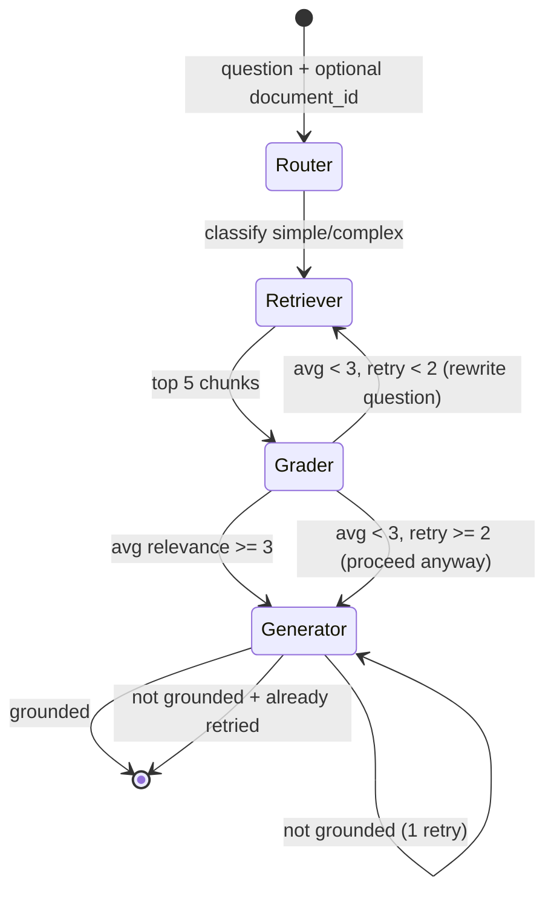

# 🧠 DocuMind

> Intelligent Document Q&A System powered by Azure OpenAI and RAG Architecture

DocuMind is a full-stack application that transforms how you interact with documents. Upload PDFs and DOCX files, then ask natural language questions to get accurate, context-aware answers with source citations—all powered by Azure OpenAI's GPT-4o and advanced Retrieval-Augmented Generation (RAG).

[](https://dotnet.microsoft.com/)
[](https://react.dev/)
[](https://azure.microsoft.com/en-us/products/ai-services/openai-service)
[](https://www.typescriptlang.org/)
[](https://www.python.org/)
[](https://fastapi.tiangolo.com/)
[](https://www.langchain.com/)
[](https://langchain-ai.github.io/langgraph/)

---

## ✨ Features

- 📄 **Multi-Format Support** - Upload and process PDF and DOCX documents with drag-and-drop
- 🤖 **AI-Powered Q&A** - Ask natural language questions and get intelligent answers using GPT-4o
- 🔍 **Semantic Search** - Vector similarity search across all your documents using Azure AI Search
- 📚 **Source Citations** - Every answer includes references with similarity scores for transparency
- ⚡ **Real-Time Streaming** - Server-Sent Events (SSE) deliver responses as they're generated
- 🎯 **Document Filtering** - Target specific documents or search across your entire library
- 🎨 **Modern UI** - Responsive React interface with Tailwind CSS and dark theme
- 🧩 **Agentic RAG Pipeline** (Python) - LangGraph state machine with query routing, relevance grading, question rewriting, and groundedness checking
- 🛡️ **Production-Ready** - Comprehensive error handling, retry logic, and rate limiting

---

## 🏗️ Architecture

DocuMind implements a **Retrieval-Augmented Generation (RAG)** pipeline:

```
┌─────────────┐
│   Upload    │
│  Document   │
└──────┬──────┘
       │
       ▼
┌─────────────────┐
│ Text Extraction │
│  & Chunking     │ ──► 500 tokens/chunk, 50-token overlap
└──────┬──────────┘
       │
       ▼
┌─────────────────┐
│   Embeddings    │
│   Generation    │ ──► text-embedding-3-small (1536 dims)
└──────┬──────────┘
       │
       ▼
┌─────────────────┐
│  Azure AI       │
│  Search Index   │ ──► Vector storage
└──────┬──────────┘
       │
       ▼
┌─────────────────┐
│  User Query     │
└──────┬──────────┘
       │
       ▼
┌─────────────────┐
│  Semantic       │
│  Search         │ ──► Top-K retrieval
└──────┬──────────┘
       │
       ▼
┌─────────────────┐
│  GPT-4o         │
│  Generation     │ ──► Context + Query → Answer
└──────┬──────────┘
       │
       ▼
┌─────────────────┐
│  Streaming      │
│  Response       │ ──► SSE to frontend
└─────────────────┘
```

### LangGraph Agentic RAG Pipeline (Python Backend)



The Python backend introduces an agentic RAG pipeline using LangGraph. Instead of a simple retrieve-and-generate flow, queries pass through four nodes with conditional routing, automatic question rewriting on low relevance, and groundedness verification.

---

## 🛠️ Technology Stack

### Backend (`DocuMind/`)
- **Framework**: ASP.NET Core 10.0 Web API (C#)
- **AI Orchestration**: Microsoft Semantic Kernel 1.74.0
- **Azure Services**:
  - Azure OpenAI (GPT-4o for generation, text-embedding-3-small for embeddings)
  - Azure AI Search 11.7.0 (vector storage and similarity search)
  - Azure Blob Storage 12.27.0 (document storage)
- **Document Processing**:
  - iText7 9.0.0 (PDF extraction)
  - DocumentFormat.OpenXml 3.2.0 (DOCX extraction)
  - Microsoft.ML.Tokenizers 1.0.2 (text chunking)
- **Resilience**: Polly 8.6.6 (retry logic and circuit breakers)
- **Testing**: xUnit 2.9.2, FsCheck 3.0.1, Moq 4.20.72

### Python Backend (`documind-api-python/`)
- **Framework**: FastAPI with uvicorn
- **AI Orchestration**: LangChain (LCEL) + LangGraph
- **LLM Chains**: ChatPromptTemplate | AzureChatOpenAI | StrOutputParser
- **State Machine**: LangGraph StateGraph with conditional edges
- **Azure Services**: Same as C# backend (Azure OpenAI, Azure AI Search, Azure Blob Storage)
- **Document Processing**: pypdf (PDF), python-docx (DOCX), tiktoken (chunking)
- **Async**: Full async/await with aiohttp for Azure SDK

### Frontend (`documind-ui/`)
- **Framework**: React 19.2 with TypeScript 5.9
- **Build Tool**: Vite 8.0
- **Styling**: Tailwind CSS 4.2
- **State Management**: Custom React hooks
- **Real-Time**: Server-Sent Events (SSE) for streaming

---

## 🔄 Backend Comparison

| Feature | C# Backend | Python Backend |
|---------|-----------|----------------|
| Framework | ASP.NET Core 10.0 | FastAPI |
| AI Orchestration | Semantic Kernel | LangChain LCEL + LangGraph |
| RAG Approach | Simple retrieve → generate | Agentic: route → retrieve → grade → generate |
| Query Routing | None | GPT-4o classifies simple/complex |
| Relevance Grading | None | Per-chunk scoring (1-5), auto-retry on low scores |
| Question Rewriting | None | Automatic rewrite on low relevance (up to 2 retries) |
| Groundedness Check | None | Post-generation verification with 1 regeneration attempt |
| Streaming | SSE via ASP.NET | SSE via FastAPI StreamingResponse |
| Error Handling | Middleware + Polly retry | Global exception handlers + ServiceUnavailableError |
| Port | 5161 | 8000 |

Both backends connect to the same Azure services and serve the same React frontend via identical SSE streaming protocols. The Python backend adds intelligence to the query pipeline — it doesn't just retrieve and generate, it evaluates whether the retrieved context is relevant enough, rewrites vague questions, and verifies the answer is grounded in the source material before returning it.

---

## 📋 Prerequisites

- [.NET 10.0 SDK](https://dotnet.microsoft.com/download/dotnet/10.0)
- [Python 3.11+](https://www.python.org/downloads/) (for Python backend)
- [Node.js 18+](https://nodejs.org/) and npm
- [Azure Subscription](https://azure.microsoft.com/free/students/) (Student or Free Tier)
- Azure Services:
  - Azure OpenAI Service with GPT-4o and text-embedding-3-small deployments
  - Azure AI Search instance
  - Azure Blob Storage account

---

## 🚀 Setup Instructions

### 1. Clone the Repository

```bash
git clone <repository-url>
cd documind
```

### 2. Backend Setup

#### Install Dependencies

```bash
cd DocuMind
dotnet restore
```

#### Configure User Secrets

DocuMind uses .NET User Secrets for secure credential management:

```bash
# Initialize user secrets (if not already done)
dotnet user-secrets init

# Set Azure OpenAI credentials
dotnet user-secrets set "AzureOpenAI:Endpoint" "https://your-resource.openai.azure.com/"
dotnet user-secrets set "AzureOpenAI:ApiKey" "your-api-key"
dotnet user-secrets set "AzureOpenAI:DeploymentName" "gpt-4o"
dotnet user-secrets set "AzureOpenAI:EmbeddingDeploymentName" "text-embedding-3-small"

# Set Azure AI Search credentials
dotnet user-secrets set "AzureAISearch:Endpoint" "https://your-search-service.search.windows.net"
dotnet user-secrets set "AzureAISearch:ApiKey" "your-search-api-key"
dotnet user-secrets set "AzureAISearch:IndexName" "documind-index"

# Set Azure Blob Storage credentials
dotnet user-secrets set "AzureBlobStorage:ConnectionString" "your-connection-string"
dotnet user-secrets set "AzureBlobStorage:ContainerName" "documents"
```

**Alternative**: Copy `secrets.json.template` to your user secrets location and fill in values.

#### Run the Backend

```bash
dotnet run
```

The API will start at `https://localhost:7777` and `http://localhost:5000`.

### 2b. Python Backend Setup (Alternative)

```bash
cd documind-api-python
python3 -m venv venv
source venv/bin/activate
pip install -r requirements.txt
```

Create a `.env` file with:

```
AZURE_OPENAI_ENDPOINT=https://your-resource.openai.azure.com/
AZURE_OPENAI_KEY=your-key
AZURE_OPENAI_GPT_DEPLOYMENT=gpt-4o
AZURE_OPENAI_EMBEDDING_DEPLOYMENT=text-embedding-3-small
AZURE_SEARCH_ENDPOINT=https://your-search.search.windows.net
AZURE_SEARCH_KEY=your-key
AZURE_SEARCH_INDEX_NAME=documind-index-python
AZURE_BLOB_CONNECTION_STRING=your-connection-string
AZURE_BLOB_CONTAINER=documents
```

Run:

```bash
python -m uvicorn main:app --host 0.0.0.0 --port 8000 --reload
```

The API will start at `http://localhost:8000`.

### 3. Frontend Setup

#### Install Dependencies

```bash
cd documind-ui
npm install
```

#### Configure Environment (Optional)

The frontend is pre-configured to proxy API requests to `http://localhost:5000`. If you need to change this, edit `vite.config.ts`.

The frontend proxy is configured in `vite.config.ts`. Set the target to `http://localhost:5161` for the C# backend or `http://localhost:8000` for the Python backend.

```typescript
server: {
  proxy: {
    '/api': {
      target: 'http://localhost:5000',
      changeOrigin: true,
    },
  },
},
```

#### Run the Frontend

```bash
npm run dev
```

The UI will start at `http://localhost:5173`.

---

## ⚙️ Configuration

### Azure OpenAI Rate Limiting

DocuMind implements intelligent rate limiting for Azure OpenAI free tier:

- **Batch Size**: 16 chunks per batch
- **Delay**: 2 seconds between batches
- **Retry Policy**: Exponential backoff with 3 retries

This configuration prevents rate limit errors while maximizing throughput.

### CORS Configuration

The backend is configured for local development with CORS enabled for:
- `http://localhost:5173` (Vite default)
- `http://localhost:5174` (Vite alternate)

For production, update `Program.cs` with your production domain.

### Chunking Strategy

Documents are split into semantic chunks:
- **Chunk Size**: 500 tokens
- **Overlap**: 50 tokens
- **Tokenizer**: cl100k_base (GPT-4 tokenizer)

This ensures context preservation across chunk boundaries.

---

## 🎯 Usage Guide

### 1. Upload Documents

- Click "Upload Documents" or drag-and-drop PDF/DOCX files
- Documents are automatically processed and indexed
- Progress indicators show upload and processing status

### 2. Ask Questions

- Type your question in natural language
- Optionally filter by specific documents
- Click "Ask" or press Enter

### 3. View Responses

- Answers stream in real-time as they're generated
- Source citations appear below with similarity scores
- Click citations to see the exact text chunks used

### Example Questions

- "What are the main findings in the research paper?"
- "Summarize the contract terms and conditions"
- "What security measures are mentioned in the documentation?"
- "Compare the pricing models across all documents"

---

## 📡 API Endpoints

### Documents

```http
POST /api/documents/upload
Content-Type: multipart/form-data

Upload one or more documents (PDF/DOCX)
```

```http
GET /api/documents
Accept: application/json

List all uploaded documents
```

```http
DELETE /api/documents/{id}

Delete a specific document
```

### Questions

```http
POST /api/documents/ask
Content-Type: application/json
Accept: text/event-stream

{
  "question": "Your question here",
  "documentIds": ["optional-doc-id"]
}

Returns SSE stream with events:
- token: Individual response tokens
- citation: Source citations with scores
- complete: End of response
- error: Error information
```

---

## 📁 Project Structure

```
documind/
├── DocuMind/                      # Backend API
│   ├── Controllers/
│   │   └── DocumentsController.cs # API endpoints
│   ├── Services/
│   │   ├── DocumentService.cs     # Document processing
│   │   ├── EmbeddingService.cs    # Vector embeddings
│   │   ├── SearchService.cs       # Azure AI Search
│   │   └── QuestionService.cs     # Q&A orchestration
│   ├── Models/
│   │   ├── Document.cs
│   │   ├── QuestionRequest.cs
│   │   └── SearchResult.cs
│   ├── Plugins/
│   │   └── DocumentPlugin.cs      # Semantic Kernel plugin
│   ├── Exceptions/
│   │   └── DocumentProcessingException.cs
│   ├── Tests/                     # Unit tests
│   ├── Program.cs                 # App configuration
│   └── DocuMind.csproj
│
├── documind-ui/                   # Frontend React app
│   ├── src/
│   │   ├── App.tsx                # Main component
│   │   ├── components/
│   │   │   ├── DocumentUpload.tsx
│   │   │   ├── QuestionInput.tsx
│   │   │   └── ResponseDisplay.tsx
│   │   ├── hooks/
│   │   │   ├── useDocuments.ts
│   │   │   └── useStreamingResponse.ts
│   │   └── types/
│   │       └── index.ts
│   ├── vite.config.ts
│   ├── tailwind.config.js
│   └── package.json
│
├── documind-api-python/               # Python Backend API
│   ├── main.py                        # FastAPI app entry point
│   ├── app/
│   │   ├── config.py                  # Environment config
│   │   ├── models.py                  # Pydantic models
│   │   ├── exceptions.py             # Custom exceptions
│   │   ├── routers/
│   │   │   ├── documents.py          # Upload & query endpoints
│   │   │   └── health.py             # Health check
│   │   ├── services/
│   │   │   ├── blob_service.py       # Azure Blob Storage
│   │   │   ├── document_service.py   # Text extraction & chunking
│   │   │   ├── embedding_service.py  # Azure OpenAI embeddings
│   │   │   └── search_service.py     # Azure AI Search
│   │   └── agents/
│   │       ├── state.py              # RAGState TypedDict
│   │       ├── nodes.py              # Router, Retriever, Grader, Generator
│   │       └── rag_graph.py          # LangGraph StateGraph assembly
│   ├── requirements.txt
│   └── .env.example
│
└── README.md                      # This file
```

---

## 🔧 Rate Limiting Deep Dive

### The Challenge

Azure OpenAI free tier has strict rate limits:
- **Tokens per minute (TPM)**: Limited quota
- **Requests per minute (RPM)**: Limited quota

Processing large documents with many chunks can quickly exceed these limits.

### The Solution

DocuMind implements a **batch processing strategy** with delays:

```csharp
// Process embeddings in batches
const int batchSize = 16;
const int delayMs = 2000;

for (int i = 0; i < chunks.Count; i += batchSize)
{
    var batch = chunks.Skip(i).Take(batchSize);
    await ProcessBatchAsync(batch);
    
    if (i + batchSize < chunks.Count)
        await Task.Delay(delayMs); // Prevent rate limiting
}
```

### Retry Policy with Polly

```csharp
services.AddHttpClient<IEmbeddingService, EmbeddingService>()
    .AddPolicyHandler(Policy
        .Handle<HttpRequestException>()
        .WaitAndRetryAsync(3, retryAttempt => 
            TimeSpan.FromSeconds(Math.Pow(2, retryAttempt))));
```

This ensures resilience against transient failures and rate limit errors.

---

## 🐛 Troubleshooting

### Backend Issues

**Problem**: `Azure OpenAI rate limit exceeded`
- **Solution**: Increase delay between batches in `EmbeddingService.cs` or reduce batch size

**Problem**: `User secrets not found`
- **Solution**: Run `dotnet user-secrets init` and set all required secrets

**Problem**: `Azure AI Search index not found`
- **Solution**: The index is created automatically on first document upload. Ensure correct credentials.

### Frontend Issues

**Problem**: `CORS error when calling API`
- **Solution**: Verify backend CORS configuration includes your frontend URL

**Problem**: `API requests fail with 404`
- **Solution**: Check Vite proxy configuration in `vite.config.ts`

**Problem**: `SSE connection drops`
- **Solution**: Check browser console for errors. Ensure backend is running and accessible.

### Common Issues

**Problem**: Document upload fails
- **Solution**: Verify Azure Blob Storage connection string and container exists

**Problem**: No search results returned
- **Solution**: Wait for document indexing to complete (check Azure AI Search portal)

---

## 🚀 Future Enhancements

- [ ] **Multi-language Support** - Support for non-English documents
- [ ] **Advanced Filters** - Filter by date, document type, tags
- [ ] **Conversation History** - Multi-turn conversations with context
- [ ] **Export Functionality** - Export Q&A sessions to PDF/DOCX
- [ ] **User Authentication** - Azure AD B2C integration
- [ ] **Document Annotations** - Highlight and annotate source text
- [ ] **Batch Questions** - Ask multiple questions at once
- [ ] **Analytics Dashboard** - Usage statistics and insights
- [ ] **Mobile App** - React Native mobile client
- [ ] **Collaborative Features** - Share documents and Q&A sessions

---

## 📊 Performance Metrics

- **Document Processing**: ~2-5 seconds per page (PDF)
- **Embedding Generation**: ~16 chunks per 2 seconds (rate-limited)
- **Search Latency**: <100ms for semantic search
- **Response Streaming**: Real-time token-by-token delivery
- **Supported Document Size**: Up to 100MB per file

---

## 🤝 Contributing

Contributions are welcome! Please follow these steps:

1. Fork the repository
2. Create a feature branch (`git checkout -b feature/amazing-feature`)
3. Commit your changes (`git commit -m 'Add amazing feature'`)
4. Push to the branch (`git push origin feature/amazing-feature`)
5. Open a Pull Request

---

## 📄 License

This project is licensed under the MIT License - see the LICENSE file for details.

---

## 🙏 Acknowledgments

- **Microsoft Semantic Kernel** - AI orchestration framework
- **Azure OpenAI** - GPT-4o and embedding models
- **Azure AI Search** - Vector search capabilities
- **iText7** - PDF text extraction
- **React & Vite** - Modern frontend tooling
- **LangChain** - LLM application framework for Python
- **LangGraph** - Agentic state machine orchestration
- **FastAPI** - High-performance Python web framework

---

## 📧 Contact

For questions, issues, or collaboration opportunities, please open an issue on GitHub.

---

<div align="center">

**Built with ❤️ using Azure AI Services**

[Report Bug](https://github.com/your-repo/issues) · [Request Feature](https://github.com/your-repo/issues)

</div>
